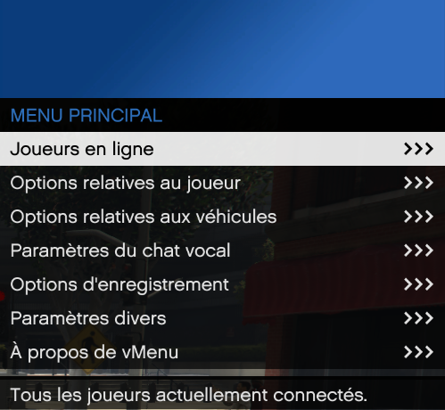
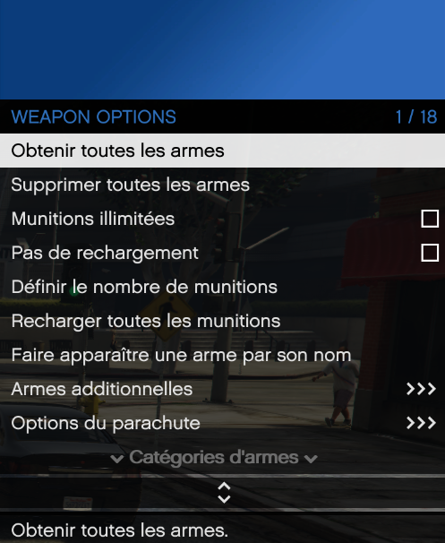
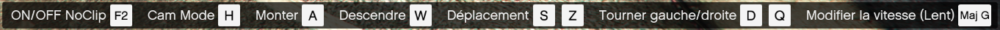

# vMenu v3.6.5 FR

## Le vMenu

vMenu est un menu de personnalisation et de gestion destiné aux serveur de roleplau sur FiveM, permettant aux joueurs de modifier facilement divers aspects de leurs véhicules, leurs apparences, etc. 
Ce menu est conçu pour améliorer l'expérience de jeu sur les serveurs FiveM, offrant une personnalisation étendue des véhicules.

## Traduction FR

vMenu est d'origine en anglais, mais il a été traduit à 99% en français pour offrir une expérience utilisateur optimale aux joueurs francophones.
Toutes les options et descriptions ont été adaptées pour garantir une navigation fluide et une compréhension complète des fonctionnalités du menu, tout en conservant la même interface conviviale.
Il est possible que certains textes n'aient pas été traduits par inattention, cela sera corrigé prochainement.

### Menu principal

### Menu arme

### NoClip

## Version

Les traductions ont été réalisées sur la dernière version du menu vMenu (3.6.5), assurant ainsi que toutes les dernières fonctionnalités et options ajoutées récemment sont également disponibles en français. 
Cela garantit une traduction quasi complète et à jour, pour une expérience sans compromis.
